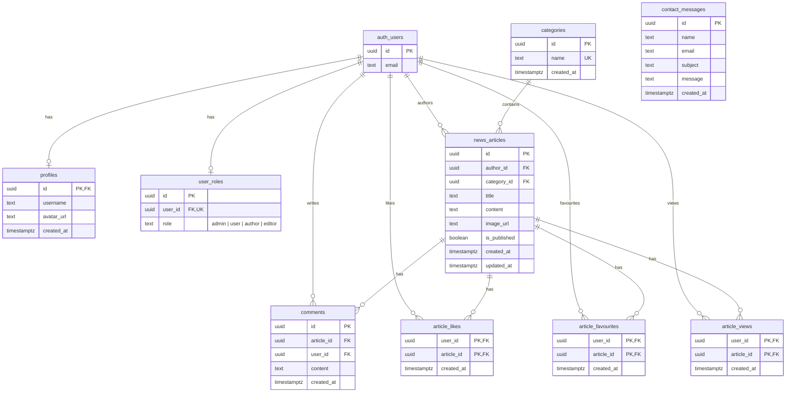

# 🏟️ The Sport News App

A fully-featured, multi-page sport news platform with role-based access control and an editorial content-moderation workflow. Built with **vanilla JavaScript**, **Vite**, and **Supabase**.

| Browse & Search | Article Details | Admin Panel |
|:-:|:-:|:-:|
| Category tabs, full-text search, pagination | Comments, likes, favourites, view counter | News / Users / Messages management |

---

## Table of Contents

- [Project Description](#project-description)
- [Architecture](#architecture)
- [Database Schema](#database-schema)
- [Local Development Setup](#local-development-setup)
- [Key Folders & Files](#key-folders--files)
- [Scripts Reference](#scripts-reference)
- [Testing](#testing)
- [License](#license)

---

## Project Description

**The Sport News App** lets visitors browse approved sport-news articles and lets authenticated users interact with the content. An editorial workflow ensures every article passes through moderation before publication.

### User Capabilities by Role

| Role | Capabilities |
|------|-------------|
| **Visitor** (anonymous) | Browse approved news, search by title/author, filter by sport category, read comments, submit contact form |
| **User** (authenticated) | Everything above + comment, like, add to favourites |
| **Author** | Everything above + create news articles (submitted as *pending*) |
| **Editor** | Review pending articles, approve / reject / edit / delete any article |
| **Admin** | Full access — manage users & roles, CRUD on all content, view contact messages |

### Core Features

- 🔐 **Authentication** — Email/password registration & login, Google OAuth, session management via Supabase Auth
- 📰 **News CRUD** — Create, read, update, delete articles with image upload (Supabase Storage)
- 🏷️ **Categories** — Football, Basketball, Tennis, Motor Sports, Volleyball, Winter Sports, Athletics, Other Sports
- 🔍 **Search & Filter** — Real-time debounced search by title/author, category tab filtering, pagination
- 💬 **Comments** — Authenticated users can comment; users can delete only their own comments
- ❤️ **Likes & Favourites** — One-like-per-user constraint, personal favourites collection
- 👁️ **View Tracking** — Unique view counts per article per user
- 📧 **Contact Form** — Public contact form; messages viewable only by admins
- 🛡️ **Row-Level Security** — All data access enforced server-side through Supabase RLS policies
- 🎨 **Modern UI** — Bootstrap 5, Lucide icons, Google Fonts (Inter + Playfair Display), CSS animations, toast notifications

---

## Architecture

```
┌─────────────────────────────────────────────────────────┐
│                       FRONTEND                          │
│  Multi-Page App (HTML + Vanilla JS ES Modules + Vite)   │
│  Bootstrap 5 · Lucide Icons · Google Fonts              │
├─────────────┬───────────────────────┬───────────────────┤
│  pages/     │  services/            │  utils/           │
│  (per-page  │  (Supabase API calls) │  (auth, navbar,   │
│   logic)    │                       │   toast, helpers)  │
└──────┬──────┴───────────┬───────────┴───────────────────┘
       │                  │
       │   Supabase JS SDK (REST + Realtime)
       │                  │
┌──────▼──────────────────▼───────────────────────────────┐
│                       BACKEND                           │
│                  Supabase (BaaS)                        │
├─────────────┬───────────────┬───────────┬───────────────┤
│  PostgreSQL │  Auth          │  Storage  │  Edge         │
│  + RLS      │  (email, OAuth)│  (images) │  Functions    │
└─────────────┴───────────────┴───────────┴───────────────┘
```

### Frontend Stack

| Technology | Purpose |
|-----------|---------|
| **Vite 6** | Build tool & dev server with HMR; multi-page app via `rollupOptions` |
| **Vanilla JS (ES Modules)** | No framework — clean, modular ES2022+ with `import`/`export` and top-level `await` |
| **Bootstrap 5.3** | Responsive layout, components, modals, and grid system (CDN) |
| **Lucide Icons** | Lightweight SVG icon library (CDN via unpkg) |
| **Google Fonts** | *Inter* (body text) + *Playfair Display* (headings) |

### Backend Stack

| Technology | Purpose |
|-----------|---------|
| **Supabase** | Backend-as-a-Service — Auth, Database, Storage, REST API |
| **PostgreSQL** | Relational database with Row-Level Security (RLS) policies |
| **Supabase Auth** | Email/password + Google OAuth authentication |
| **Supabase Storage** | `article-images` public bucket for news article images |

### Design Principles

- **Multi-page architecture** — Each page is a separate HTML file (not a SPA)
- **Separation of concerns** — `pages/` (UI logic), `services/` (data), `utils/` (helpers)
- **Security by default** — RLS policies enforce access control server-side; frontend never bypasses security
- **No hardcoded admin logic** — Role checks happen at the database level via `get_my_role()` helper function

---

## Database Schema

### Entity Relationship Diagram



### Tables Overview

| Table | Description | Key Constraints |
|-------|-------------|-----------------|
| `profiles` | Public user profile data (mirrors `auth.users`) | PK = `id` (FK → `auth.users`) |
| `user_roles` | Maps users to roles: `admin`, `user`, `author`, `editor` | Unique on `user_id`; CHECK constraint on `role` |
| `categories` | Sport categories for filtering articles | Unique on `name` |
| `news_articles` | News content with editorial status | FK → `auth.users`, FK → `categories`; `is_published` defaults `FALSE` |
| `comments` | User comments on articles | FK → `news_articles` (CASCADE), FK → `auth.users` (CASCADE) |
| `article_likes` | One-like-per-user per article | Composite PK (`user_id`, `article_id`) |
| `article_favourites` | User's saved articles collection | Composite PK (`user_id`, `article_id`) |
| `article_views` | Unique view tracking per user per article | Composite PK (`user_id`, `article_id`) |
| `contact_messages` | Contact form submissions | Public INSERT; admin-only SELECT/UPDATE/DELETE |

### Row-Level Security Summary

| Table | Policy Highlights |
|-------|------------------|
| `profiles` | Users read/update only their own profile |
| `user_roles` | Users read own role; admins CRUD all roles |
| `categories` | Public read; admin-only write |
| `news_articles` | Public reads published only; authors see own drafts; editors see all for moderation; admins full access |
| `comments` | Public read (on published articles); authenticated insert own; delete own |
| `article_likes` / `article_favourites` | Users CRUD only their own rows |
| `article_views` | Public read (for counters); authenticated insert own |
| `contact_messages` | Anonymous insert; admin-only read/update/delete |

### Helper Function

```sql
-- Resolves the current user's role (used in all RLS policies)
CREATE OR REPLACE FUNCTION public.get_my_role()
RETURNS TEXT LANGUAGE sql STABLE SECURITY DEFINER AS $$
  SELECT role FROM public.user_roles WHERE user_id = auth.uid() LIMIT 1;
$$;
```

---

## Local Development Setup

### Prerequisites

- **Node.js** ≥ 18
- **npm** ≥ 9
- A **Supabase** project ([create one free](https://supabase.com/dashboard))

### 1. Clone the Repository

```bash
git clone https://github.com/<your-username>/Sport-News-App.git
cd Sport-News-App
```

### 2. Install Dependencies

```bash
npm install
```

### 3. Configure Environment Variables

```bash
cp .env.example .env
```

Open `.env` and fill in your Supabase credentials (found in **Supabase Dashboard → Settings → API**):

```env
VITE_SUPABASE_URL=https://your-project-id.supabase.co
VITE_SUPABASE_ANON_KEY=your-anon-key-here
```

### 4. Apply Database Migrations

Run the SQL migration files in order against your Supabase project. You can execute them in the **Supabase SQL Editor** (Dashboard → SQL Editor) or using the Supabase CLI:

```bash
# Using Supabase CLI (if installed)
supabase db push
```

Or manually execute each file from `supabase/migrations/` in chronological order:

1. `20260227_initial_schema.sql` — Core tables (profiles, user_roles, categories, news_articles, comments)
2. `20260227_enable_rls_policies.sql` — RLS policies and `get_my_role()` helper
3. `20260227_add_image_url_and_storage.sql` — Image column + storage bucket
4. `20260227_admin_delete_user_function.sql` — Admin user deletion function
5. `20260227_admin_insert_profiles.sql` — Admin profile insertion policy
6. `20260227_admin_select_all_profiles.sql` — Admin profile query policy
7. `20260301_add_article_likes_and_favourites.sql` — Likes & favourites tables
8. `20260301_add_article_views.sql` — View tracking table
9. `20260301_add_contact_messages.sql` — Contact messages table
10. `20260301_add_other_sports_category.sql` — "Other Sports" category seed
11. `20260301_article_likes_public_count.sql` — Public like count policy
12. `20260301_comments_profiles_fk_and_public_read.sql` — Comment FK & policies
13. `20260301_news_articles_author_profiles_fk.sql` — Author profile FK

### 5. Configure Supabase Auth (Google OAuth — Optional)

1. In **Supabase Dashboard → Authentication → Providers**, enable **Google**.
2. Add your Google OAuth client ID and secret.
3. Set the redirect URL to `http://localhost:5173/auth/callback/`.

### 6. Start the Development Server

```bash
npm run dev
```

The app will be available at **http://localhost:5173**.

### 7. Build for Production

```bash
npm run build
npm run preview   # Preview the build locally
```

---

## Key Folders & Files

```
Sport-News-App/
├── index.html                  # Home page entry point
├── package.json                # Dependencies & scripts
├── vite.config.js              # Vite multi-page build + Vitest config
├── .env.example                # Environment variable template
│
├── auth/callback/index.html    # OAuth callback handler page
├── login/index.html            # Login page entry point
├── profile/index.html          # Profile page entry point
├── pages/                      # Additional HTML pages
│   ├── about.html              # About page
│   ├── admin.html              # Admin panel
│   ├── contact.html            # Contact form
│   ├── create-news.html        # Article creation form
│   ├── edit-news.html          # Article editor
│   ├── news-details.html       # Single article view
│   ├── profile.html            # Profile (alt route)
│   ├── register.html           # Registration form
│   └── login.html              # Login (alt route)
│
├── src/
│   ├── pages/                  # Page-specific JavaScript modules
│   │   ├── home.js             # News grid, search, filter, pagination
│   │   ├── news-details.js     # Article view, comments, likes, favs
│   │   ├── profile.js          # User profile, my articles, favourites
│   │   ├── admin.js            # Admin panel (news/users/messages tabs)
│   │   ├── create-news.js      # Article creation with image upload
│   │   ├── edit-news.js        # Article editing
│   │   ├── login.js            # Login form handler
│   │   ├── login-page.js       # Login page with OAuth
│   │   ├── register.js         # Registration form handler
│   │   ├── contact.js          # Contact form submission
│   │   └── auth-callback.js    # OAuth callback processor
│   │
│   ├── services/               # Supabase API communication layer
│   │   ├── supabaseClient.js   # Singleton Supabase client instance
│   │   ├── newsService.js      # News CRUD, comments, likes, favs, views
│   │   └── adminService.js     # Admin operations (users, roles, messages)
│   │
│   ├── utils/                  # Shared utilities
│   │   ├── auth.js             # Auth state management & session helpers
│   │   ├── navbar.js           # Dynamic navbar with role-based links
│   │   └── toast.js            # Lightweight toast notification system
│   │
│   └── styles/
│       └── main.css            # Global styles, CSS variables, animations
│
├── supabase/
│   └── migrations/             # SQL migration files (13 files)
│       ├── 20260227_*.sql      # Initial schema, RLS, storage, admin functions
│       └── 20260301_*.sql      # Likes, favs, views, contacts, FKs
│
├── tests/                      # Vitest test suite
│   ├── setup.js                # Test environment setup
│   ├── mocks/
│   │   └── supabaseMock.js     # Supabase client mock
│   ├── services/
│   │   ├── newsService.test.js # News service tests (31 tests)
│   │   └── adminService.test.js# Admin service tests (10 tests)
│   └── utils/
│       ├── auth.test.js        # Auth utility tests (6 tests)
│       └── helpers.test.js     # Helper function tests (15 tests)
│
└── public/                     # Static assets (served as-is)
```

### File Purpose Quick Reference

| File / Folder | Purpose |
|--------------|---------|
| `vite.config.js` | Configures Vite for multi-page build (10 HTML entry points) and Vitest test runner |
| `src/services/supabaseClient.js` | Creates and exports the singleton `supabase` client using env vars |
| `src/services/newsService.js` | All news-related DB operations: fetch, create, update, delete, comments, likes, favourites, views |
| `src/services/adminService.js` | Admin-specific operations: user management, role assignment, contact messages |
| `src/utils/auth.js` | `getSession()`, `getUser()`, `getUserRole()`, `onAuthStateChange()`, `signOut()` |
| `src/utils/navbar.js` | Renders the navigation bar dynamically based on auth state and user role |
| `src/utils/toast.js` | `showToast(message, type, duration)` — non-blocking notification system |
| `src/styles/main.css` | Design system with CSS custom properties, responsive breakpoints, animations |

---

## Scripts Reference

| Command | Description |
|---------|-------------|
| `npm run dev` | Start Vite dev server with HMR |
| `npm run build` | Production build to `dist/` |
| `npm run preview` | Preview the production build locally |
| `npm test` | Run all tests once (Vitest) |
| `npm run test:watch` | Run tests in watch mode |

---

## Testing

The project uses **Vitest** with 62 tests across 4 test files:

```bash
npm test
```

| Test File | Tests | Coverage |
|-----------|-------|----------|
| `newsService.test.js` | 31 | News CRUD, comments, likes, favourites, views, search, pagination |
| `helpers.test.js` | 15 | Utility/helper functions |
| `adminService.test.js` | 10 | User management, role assignment, message operations |
| `auth.test.js` | 6 | Session management, auth state changes |

All Supabase calls are mocked via `tests/mocks/supabaseMock.js` so tests run without a database connection.

---

## License

This project is for educational purposes.